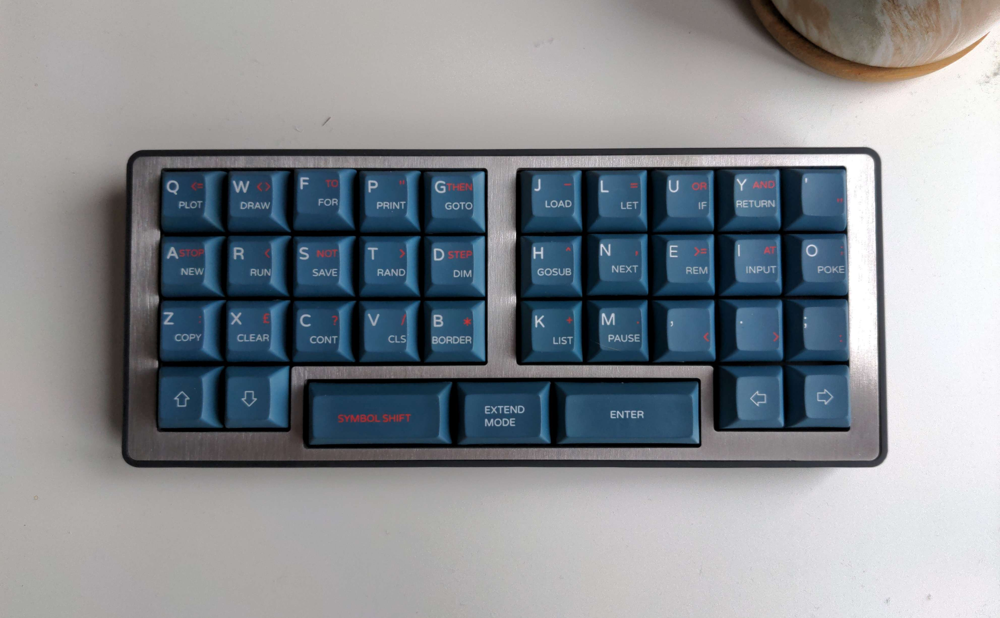
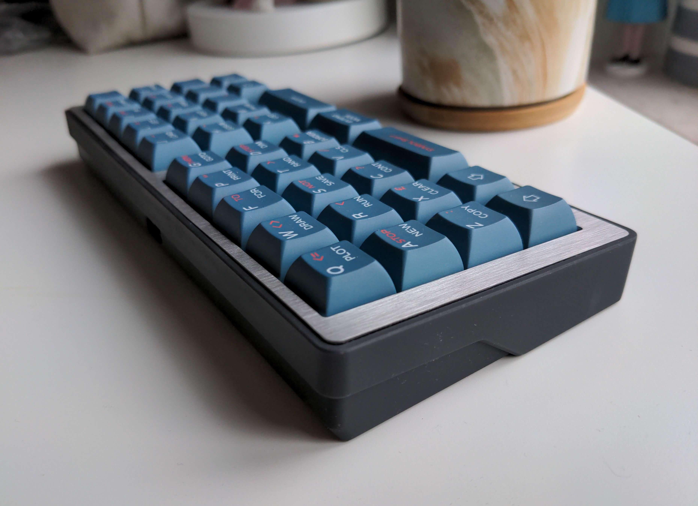

# Brk Out

38 key orthogonal keyboard with split alphas and offset space

## Features

- MX switches w/ hotswap
- Seeed Xiao RP2040 or Seeed Xiao BLE Controller on an [Orthocade MCU board](https://github.com/weteor/orthocade_mcu_board)
- case files are supplied (stl, dxf, as well as the freecad files)
- support for ZMK firmware (Xiao BLE) or QMK w/vial (Xiao RP2040)
- completely open source, permissive license
- bottom rows supported: 
  - 2.25u - 1.5u - 2.25u
  - 1.25u - 1.75u - 1.75u -  1.25u
  - 1u -  2u - 2u - 1u

## Want one?

All production files you need to build your own board can be found [here](./prod).

Gerber files as well as files needed for 3d printing are provided. Please note that the case design that supports the acryl layin may not be SLN printable. Please print them either in resin or nylon. I've used JLCPCBs printing service (black resin) and it turned out very good, so maybe take a look at that option.

Parts needed beside the MCU board and pcbs:

- a 20pin 0.5mm pitch FCC/FCP Connector

- 38 mx hotswap sockets

- 38 1N4148 diodes in SOT-123 package

- 38 of your favourite switches

### the rest

Everything in this repository is free to use however you might see fit. If you want to support me and my projects, please consider linking back to this repository if you build/change/use anything.

If you would like to send me a tip, you could do it [here](https://ko-fi.com/weteor) (Please don't feel like you have to).

### some more images

